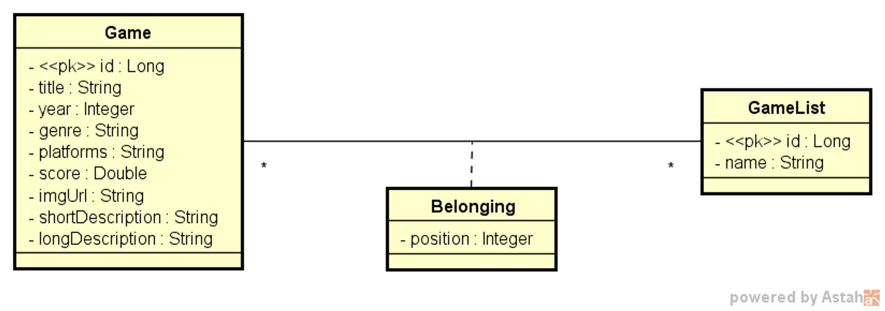
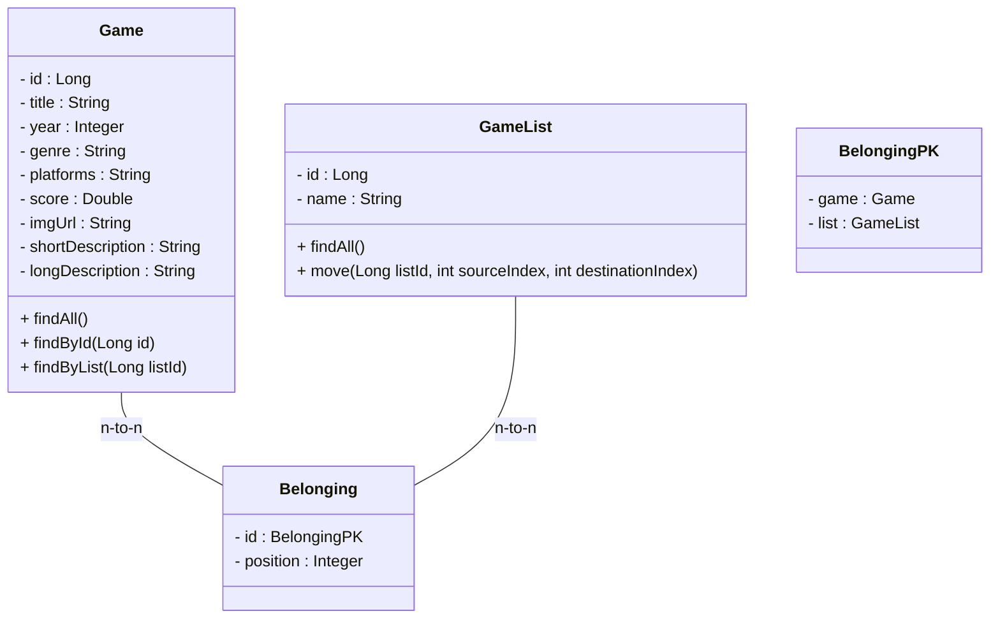
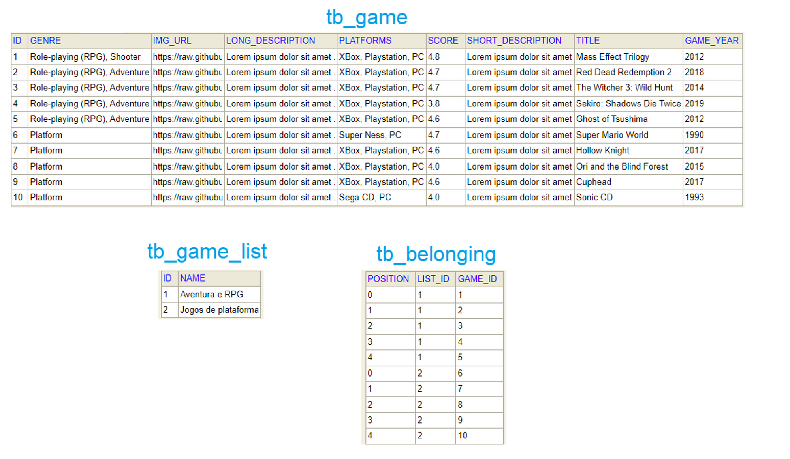
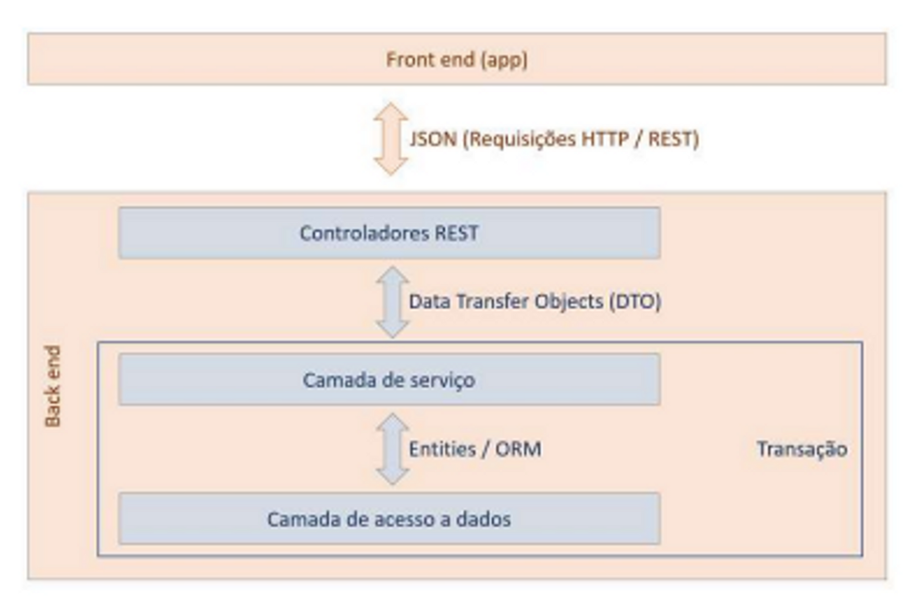
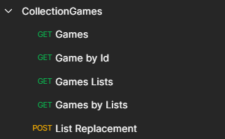

<h1 align="center">GameCollection</h1>

Organize sua coleção de games de um jeito prático e divertido com este sistema de gerenciamento! 

O projeto foi desenvolvido no Framework Spring, utilizando a arquitetura API Rest e a comunicação com o banco de dados.

<b>Diferencial:</b> Reposicionar os jogos na coleção, atualizando as informações diretamente no banco de dados.

Agora, organizar sua coleção nunca foi tão fácil e eficiente!

 

<h2> 🛠 Tecnologias: </h2>

As seguintes tecnologias foram usadas na construção do projeto:

<!-- 
 -->

### 💬 Assuntos abordados:
- Sistemas web e recursos
- Cliente/servidor, HTTP, JSON
- Padrão Rest para API web
- Estruturação de projeto Spring Rest
- Entidades e Mapeamento Objeto-Relacional (ORM)
- Database Seeding
- Padrão camadas
- Controller, Service, Repository
- Modelo de domínio
- Padrão DTO
- Relacionamentos N-N
- Classe de associação, Embedded id
- Consultas SQL no Spring Data JPA
- Projections

## Modelo de domínio

## Diagrama de Classes do Projeto:

O Projeto é composto por 3 Recursos (*Conjunto de Classes e Interfaces responsáveis por mapear um tipo de Objeto e persistir no Banco de dados Relacional*) e uma Classe auxiliar:

| Classe | Descrição |
| --- | --- |
| Game | Recurso responsável por definir o Objeto Game (jogos da nossa coleção) |
| GameList | Recurso responsável por definir o Objeto GameList (coleção) |
| Belonging | Classe de associação entre Game  e GameList. Recurso responsável por indicar a posição do Game dentro do GameList. |
| Belonging PK | Classe auxiliar, que será utilizada como chave primaria múltipla,  composto por 2 atributos ‘game_id’ e ‘list_id’ |

Cada Recurso gera uma tabela no Banco de dados da aplicação, exceto a Classe auxiliar.

## Modelo de Relacional

## Padrão Camadas

## EndPoints:

Abaixo consta os recursos da API:

## Dependências utilizadas no projeto:

| Dependência | Descrição |
| --- | --- |
| Spring Web | Essa dependência fornece todas as bibliotecas necessárias para criar um projeto WEB e trabalhar com o protocolo HTTP/HTTPS. |
| Spring Data JPA | Java Persistence API (JPA) é uma Biblioteca que armazena e recupera Objetos, que foram persistidos (armazenados) em um Bancos de Dados. |
| PostgreSQL Driver | Responsável pela conexão entre nossa aplicação e o Banco de Dados PostgreSQL |
| H2 Database | Responsável pela conexão entre nossa aplicação e o Banco de Dados H2 |

<h2> Autor: </h2>

Feito com ❤️ por Giselle Souza. 👋
 

